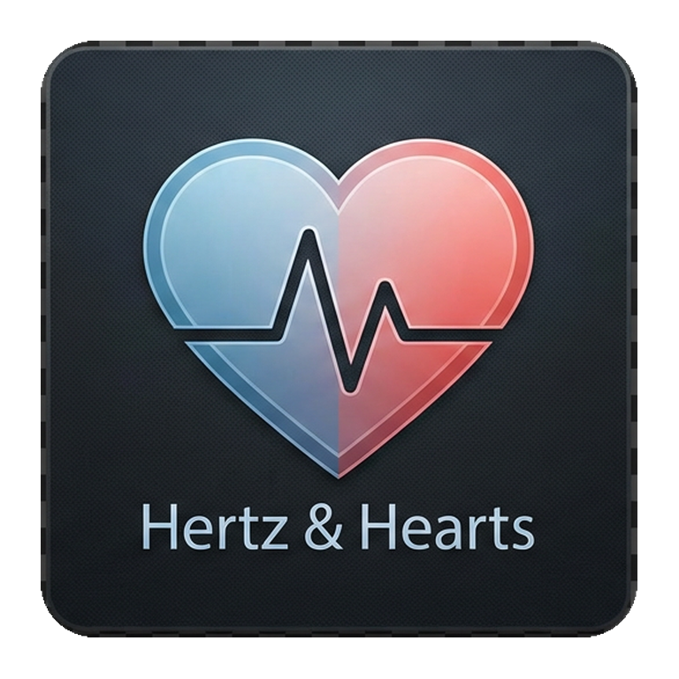
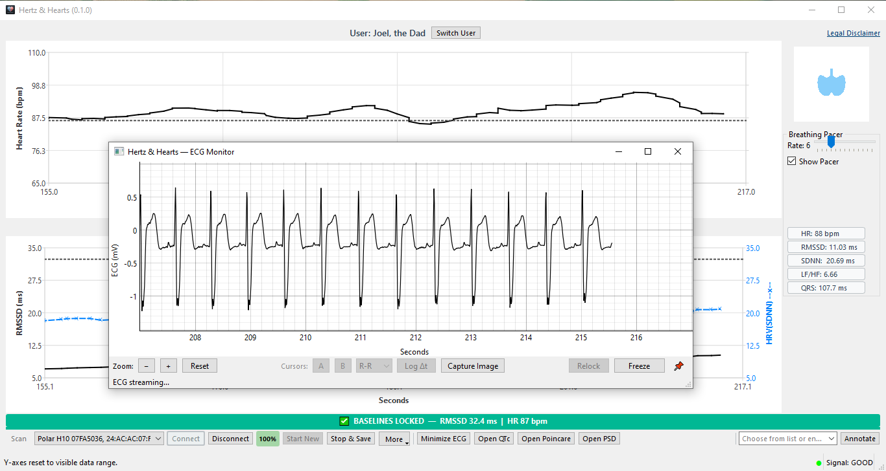
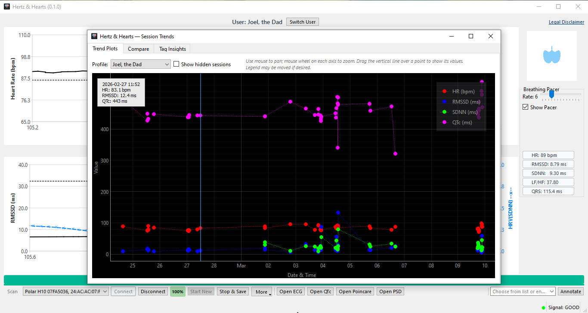
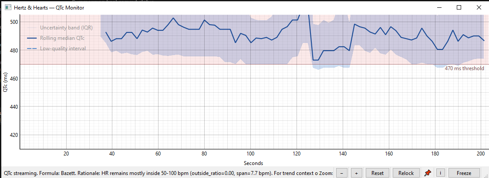
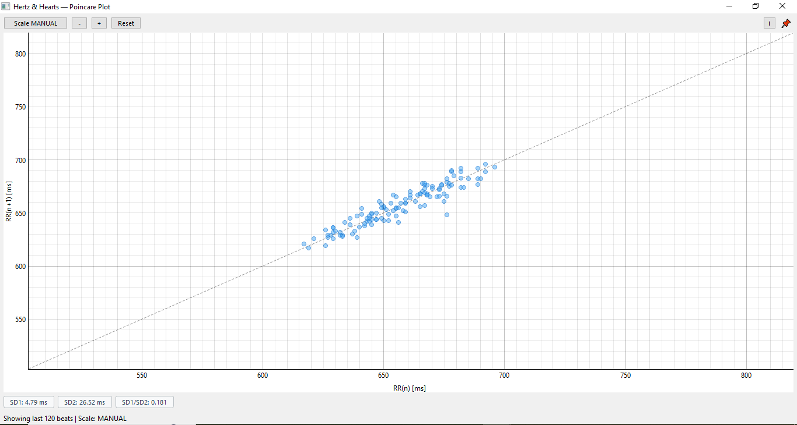
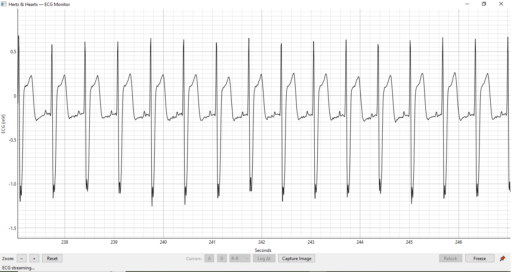
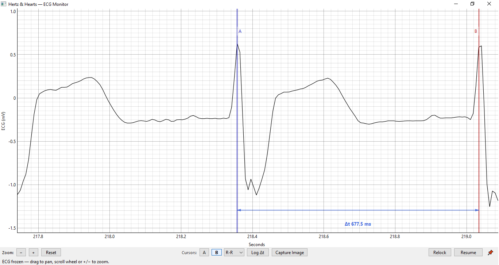

# Hertz & Hearts

Desktop HRV biofeedback app for ECG chest straps.
Current beta: **1.0.0-beta**.

**Research use only. Not for clinical diagnosis or treatment.**

## Start Here

- Recommended for most users (Windows/macOS/Linux):
  - Download a prebuilt package from Releases:
    - https://github.com/JoelAtHome/HertzAndHearts/releases
- Install from source (all platforms):
  - `python -m pip install .`
- Launch:
  - Windows: `py -3 -m hnh.app` (or `python -m hnh.app`)
  - macOS/Linux: `python3 -m hnh.app` (or `hnh` if on PATH)
- Pair your sensor in OS Bluetooth settings, then in-app:
  - `Scan` -> select sensor -> `Connect`
- Start a session:
  - `Start New` -> record -> `Stop & Save`

For full walkthrough:
- `docs/USER_GUIDE.md`

For troubleshooting:
- `docs/troubleshooting.md`

Cardiac theory notes (QRS + HRV compendium, Markdown):
- `docs/cardiac-compendium.md` (full) · `docs/part-i-qrs-waveform-fundamentals.md` · `docs/part-ii-hrv-autonomic-metrics.md`
- QRS Word source (local): `docs/cardiac-source/` — figures export to `docs/assets/cardiac-qrs/` for Markdown
- Regenerate from Word sources: `python docs/cardiac_md_export.py`

## Downloads

- Prebuilt artifacts are published in GitHub Releases:
  - https://github.com/JoelAtHome/HertzAndHearts/releases

## Compatible Sensors

- Polar H7, H9, H10
- Decathlon Dual HR (model ZT26D)

## Beta Testing

- Tester announcement: `docs/BETA_ANNOUNCEMENT.md`
- Tester instructions: `docs/BETA_TESTER_INSTRUCTIONS.md`
- Public release checklist: `docs/PUBLIC_RELEASE_CHECKLIST.md`
- BLE platform matrix: `docs/BLE_PLATFORM_VALIDATION_MATRIX.md`

## Packaging

- Cross-platform packaging: `docs/PACKAGING.md`

## Screenshots and Example Report Assets

- Suggested screenshot/report capture plan: `docs/SCREENSHOT_AND_REPORT_ASSETS.md`

### Quick Tour

**1) Live session dashboard with ECG monitor**



**2) Session Trends for cross-session comparison**



**3) QTc monitor with uncertainty band and threshold context**



**4) Poincare plot for beat-to-beat variability shape**



**5) ECG monitor (streaming view)**



**6) ECG monitor (frozen view with cursor measurement)**



For reusable caption text, see `docs/assets/CAPTIONS.md`.

## Upstream Acknowledgment

Hertz & Hearts is built upon OpenHRV by Jan C. Brammer.

- Upstream project: https://github.com/JanCBrammer/OpenHRV
- Continuation/fork remains GPL-3.0 licensed.

## License and Disclaimer

- License: GPL-3.0 (`LICENSE`)
- Full research-use disclaimer: `hnh/disclaimer.md`

## Development

- Install dev tooling and Git hooks (PyInstaller spec allowlist, `compileall hnh`, YAML/TOML checks, whitespace):

  ```bash
  python -m pip install -e ".[dev]"
  pre-commit install
  ```

  Run all hooks without committing: `pre-commit run --all-files` (same as CI).

## Contributing, Support, and Feedback

- Bug reports:
  - https://github.com/JoelAtHome/HertzAndHearts/issues/new?template=bug_report.yml
- Feature requests:
  - https://github.com/JoelAtHome/HertzAndHearts/issues/new?template=feature_request.yml
- Optional support:
  - GitHub Sponsors: https://github.com/sponsors/JoelAtHome
  - Buy Me a Coffee: https://buymeacoffee.com/JoelAtHome

Please search existing issues before filing a new one.
