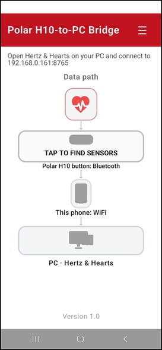
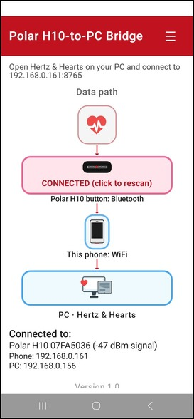
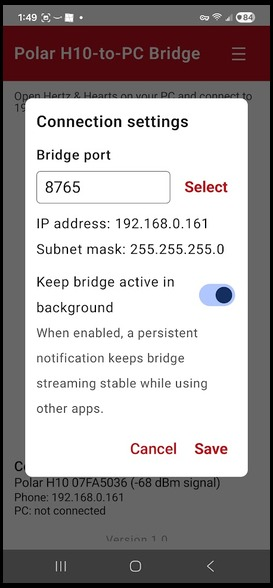

# Hertz & Hearts

Desktop HRV biofeedback app for ECG chest straps.
Current beta: **1.0.0-beta.1**.

**Research use only. Not for clinical diagnosis or treatment.**

## Start Here

- Recommended for most users (Windows/macOS/Linux):
  - Download a prebuilt package from Releases:
    - https://github.com/JoelAtHome/HertzAndHearts/releases
- Install from source (all platforms):
  - `python -m pip install .`
- Launch:
  - Windows: `py -3 -m hnh.app` (or `python -m hnh.app`)
  - macOS/Linux: `python3 -m hnh.app` (or `hnh` if on PATH)
- Pair your sensor in OS Bluetooth settings, then in-app:
  - `Scan` -> select sensor -> `Connect`
- Start a session:
  - `Start New` -> record -> `Stop & Save`

For full walkthrough:
- `docs/USER_GUIDE.md`

For troubleshooting:
- `docs/troubleshooting.md`

Cardiac theory notes (QRS + HRV compendium, Markdown):
- `docs/cardiac-compendium.md` (full) · `docs/part-i-qrs-waveform-fundamentals.md` · `docs/part-ii-hrv-autonomic-metrics.md`
- QRS Word source (local): `docs/cardiac-source/` — figures export to `docs/assets/cardiac-qrs/` for Markdown
- Regenerate from Word sources: `python docs/cardiac_md_export.py`

## Downloads

- Prebuilt artifacts are published in GitHub Releases:
  - https://github.com/JoelAtHome/HertzAndHearts/releases

## Phone Bridge (Android, optional)

Most users can connect the strap directly with **PC BLE**. **Phone Bridge** is optional, but it can be much more stable when your computer’s Bluetooth stack struggles (scan failures, frequent disconnects, choppy streaming). In that setup your **phone** keeps the BLE link to the strap and forwards live data to Hertz & Hearts on the PC over **Wi‑Fi** (same LAN as the PC).

**Download and install the bridge app**

1. Open **Releases** (same page as the desktop downloads):  
   https://github.com/JoelAtHome/HertzAndHearts/releases  
2. On the release you are using, download **`PolarH10Bridge-debug-<tag>.apk`** (debug build of the Polar H10-to-PC bridge app).
3. Copy the APK to your Android phone (USB, cloud storage, etc.).
4. On the phone, allow installation from your file manager or browser if prompted (“unknown apps”), then open the APK and install.

If you need a build from **`main`** that is not on a release yet, use **Actions** → workflow **`android-bridge`** → artifact **`PolarH10Bridge-debug-apk`** (`app-debug.apk` inside the zip):  
https://github.com/JoelAtHome/HertzAndHearts/actions/workflows/android-bridge.yml

**Use it with Hertz & Hearts**

- In Hertz & Hearts, set **Connection Mode** to **Phone Bridge**, enter your **phone’s Wi‑Fi IP address** and port (**8765** by default), then **Connect**. The bridge app shows the address to use (your numbers will differ from any screenshot).
- Full walkthrough, permissions (Bluetooth, location for BLE scan), and troubleshooting: **`docs/PHONE_BRIDGE_QUICKSTART.md`**.

## Compatible Sensors

- Polar H7, H9, H10
- Decathlon Dual HR (model ZT26D)

## Beta Testing

- Tester announcement: `docs/BETA_ANNOUNCEMENT.md`
- Tester instructions: `docs/BETA_TESTER_INSTRUCTIONS.md`
- Public release checklist: `docs/PUBLIC_RELEASE_CHECKLIST.md`
- BLE platform matrix: `docs/BLE_PLATFORM_VALIDATION_MATRIX.md`

## Packaging

- Cross-platform packaging: `docs/PACKAGING.md`

## Screenshots and Example Report Assets

- Suggested screenshot/report capture plan: `docs/SCREENSHOT_AND_REPORT_ASSETS.md`

### Quick Tour

**1) Live session dashboard with ECG monitor**


**2) Session Trends for cross-session comparison**


**3) QTc monitor with uncertainty band and threshold context**


**4) Poincare plot for beat-to-beat variability shape**


**5) ECG monitor (streaming view)**


**6) ECG monitor (frozen view with cursor measurement)**


**7) Polar H10-to-PC Bridge — main screen (tap to find sensors, PC IP:port hint)**



**8) Polar H10-to-PC Bridge — connected (Bluetooth to phone, Wi‑Fi to Hertz & Hearts)**



**9) Polar H10-to-PC Bridge — connection settings (port, network, background keep‑alive)**



For reusable caption text, see `docs/assets/CAPTIONS.md`.

## Upstream Acknowledgment

Hertz & Hearts is built upon OpenHRV by Jan C. Brammer.

- Upstream project: https://github.com/JanCBrammer/OpenHRV
- Continuation/fork remains GPL-3.0 licensed.

## License and Disclaimer

- License: GPL-3.0 (`LICENSE`)
- Full research-use disclaimer: `hnh/disclaimer.md`

## Development

- Install dev tooling and Git hooks (PyInstaller spec allowlist, `compileall hnh`, YAML/TOML checks, whitespace):

  ```bash
  python -m pip install -e ".[dev]"
  pre-commit install
  ```

  Run all hooks without committing: `pre-commit run --all-files` (same as CI).

## Contributing, Support, and Feedback

- Bug reports:
  - https://github.com/JoelAtHome/HertzAndHearts/issues/new?template=bug_report.yml
- Feature requests:
  - https://github.com/JoelAtHome/HertzAndHearts/issues/new?template=feature_request.yml
- Optional support:
  - GitHub Sponsors: https://github.com/sponsors/JoelAtHome
  - Buy Me a Coffee: https://buymeacoffee.com/JoelAtHome

Please search existing issues before filing a new one.
