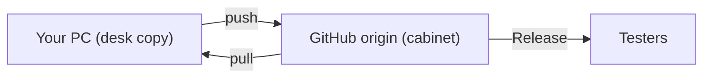

# GitHub and related repositories (plain language)

A one-page map of **this desktop repo**, the **phone app repo**, and the words Git keeps using. You do not need to be a Git expert to ship Hertz & Hearts. You do need to know which cabinet you are filing into.

## The two products

| Product | GitHub repo | What testers download |
| --- | --- | --- |
| Hertz & Hearts (HnH) desktop | [JoelAtHome/HertzAndHearts](https://github.com/JoelAtHome/HertzAndHearts) | Windows zip / installer from **this** repo’s Releases |
| Polar H10 / ECG phone bridge | [JoelAtHome/ECG-Phone-Bridge](https://github.com/JoelAtHome/ECG-Phone-Bridge) | `.apk` from **that** repo’s Releases (or Actions) |

They talk to each other over Wi‑Fi. They are **not** the same git repo. A commit in HertzAndHearts does not build an APK. An APK build does not update the desktop app.

Keep each repo in **its own folder**. If Cursor (or another agent) has two chats open, check the folder in the title bar before you say “commit this.”

Pointer for old bookmarks: `Android Bridge App/README.md` in this repo.

## Words that get mixed up

Think of GitHub as a **shared filing cabinet** and your PC as **your desk**.

| Word | Plain meaning |
| --- | --- |
| **Commit** | A named snapshot of files **on your machine**. Still private until you push. |
| **Branch** | A label on a line of snapshots. `main` is the public line testers and CI follow. |
| **Remote / origin** | GitHub’s copy of the repo. |
| **Push** | Send your snapshots **to GitHub**. |
| **Pull** | Bring GitHub’s snapshots **onto your machine**. |
| **Fetch** | Look at GitHub’s new snapshots without applying them yet. |
| **Rebase / merge** | Replay or combine your snapshots with someone else’s when both of you changed `main`. |
| **Release / tag** | A **named download** (installer, zip, APK). Not the same as “I committed.” |
| **Version number** | The label on a Release (`1.0.0-beta.5`). Bump it when you **publish a download**, not on every commit. |

## Daily loop on `main`

1. Edit files in **one** repo folder.
2. **Commit** (snapshot on the desk).
3. If GitHub `main` moved while you were working, **pull --rebase** (or ask the agent to) so your snapshot sits on top of theirs.
4. **Push** so GitHub has it.
5. Only then does CI, a teammate, or another Cursor window see it.

Push is **rejected** when GitHub already has commits you do not. That is normal, not a broken laptop. Fix: put your commit on top of theirs, then push. Do **not** force-push `main`.

## What “ship it” actually is

| You want… | Do this |
| --- | --- |
| Save work and share source | Commit + push in the matching repo |
| Testers get a **new desktop build** | Bump version in HertzAndHearts, changelog, GitHub **Release** (tag like `v1.0.0-beta.5`). CI uploads the zip/installer. |
| Testers get a **new phone app** | Commit + Release (or Actions APK) in **ECG-Phone-Bridge**. Sideload that APK. |
| Fix live charts / Connect in HnH | HertzAndHearts only |
| Phone accepts a new PC after a stuck session | ECG-Phone-Bridge APK (replace-on-new-connect) **and** the matching HnH desktop if you also changed HnH |

`changelog.md` **Unreleased** = landed in git, not necessarily a numbered installer yet.

## Two Cursor agents

One agent can work in HertzAndHearts while another builds the APK in ECG-Phone-Bridge. That is correct. Each agent should:

- Commit only in **its** repo
- Push only that repo
- Not copy phone Kotlin into this tree or desktop Python into the phone tree

If Connect still fails after you push HnH, the phone may still be holding the old TCP slot. See `docs/PHONE_BRIDGE_QUICKSTART.md` (cycle the bridge app until the replace-on-connect APK is installed).

## Related docs

- Phone setup: `docs/PHONE_BRIDGE_QUICKSTART.md`
- Desktop packaging / CI: `docs/PACKAGING.md`
- Testers: `docs/BETA_TESTER_INSTRUCTIONS.md`
