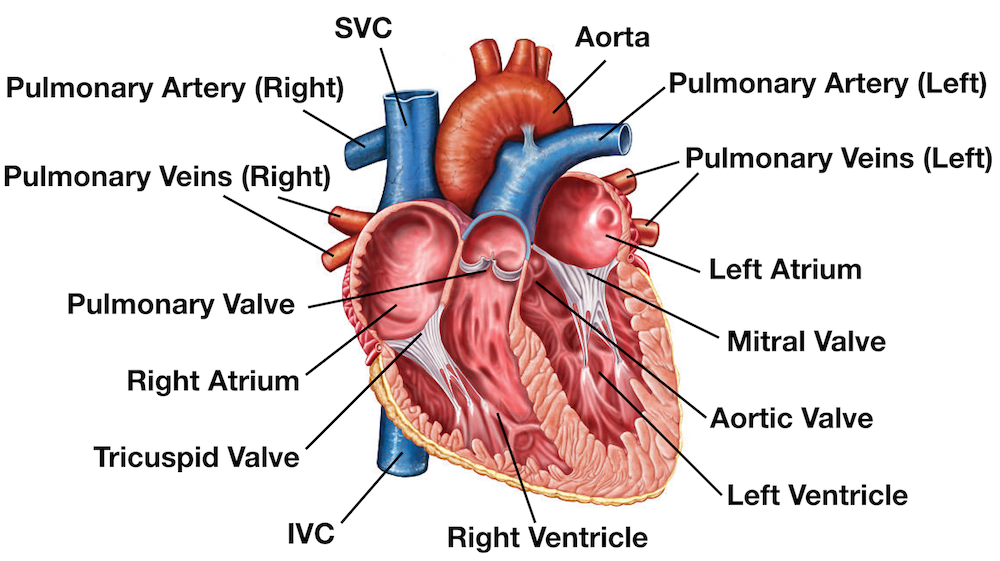
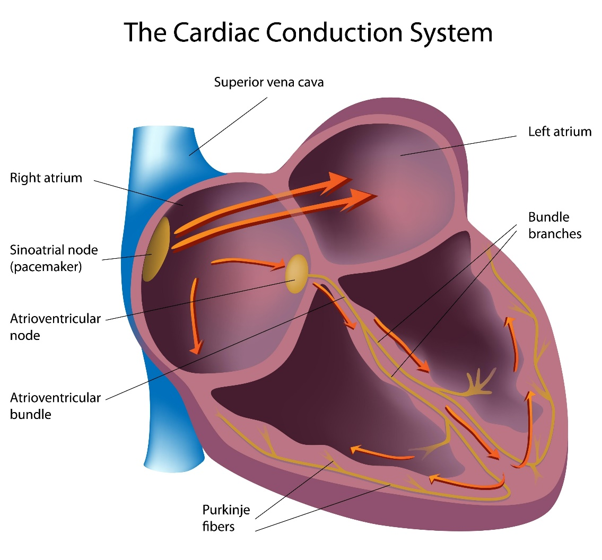
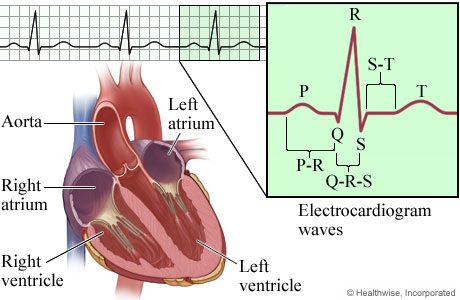
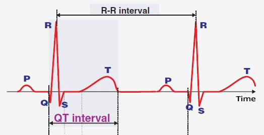

<!--
  Title: Part I — QRS waveform fundamentals
  Source: docs\cardiac-source\Intro to QRS Cardiac Waveform rev 15MAR2026 - Reorganized.docx
  Generated: 2026-03-21
  Regenerate: python docs/cardiac_md_export.py
-->

> **Figures:** extracted to `docs/assets/cardiac-qrs/` for Markdown. The Word source remains authoritative if anything looks off.

## Companion documents

- Full combined guide: [cardiac-compendium.md](cardiac-compendium.md)
- Part II (HRV / LF–HF): [part-ii-hrv-autonomic-metrics.md](part-ii-hrv-autonomic-metrics.md)

---

# QRS Complex: Components and Definitions
              (source: Brave browser AI search engine)

## Background: How the Heart Pumps

The heart's pumping action involves four chambers working in coordination to circulate blood:

Right atrium: Receives oxygen-poor blood from the body and pumps it into the right ventricle through the tricuspid valve.

Right ventricle: Pumps the oxygen-poor blood to the lungs via the pulmonary artery (through the pulmonary valve) to pick up oxygen.

Left atrium: Receives oxygen-rich blood from the lungs and sends it to the left ventricle through the mitral valve.

Left ventricle: The most muscular chamber; pumps oxygen-rich blood out through the aortic valve into the aorta, delivering blood to the entire body.

The pumping cycle consists of two phases:

Diastole: Chambers relax and fill with blood.

Systole: Chambers contract, pushing blood out (atria first, then ventricles).

One-way valves ensure blood flows forward and does not back up.

*Figure 1: The Human Heart*

## Electrical Cardiac Signals

To understand the electrical cycle of the heart, it helps to view depolarization and repolarization as the "electrical triggers" for the mechanical pumping action.

*Figure 2: The Cardiac Conduction System*

### Depolarization: The "Contract" Signal

Depolarization is the electrical discharge that triggers the heart muscle to contract (systole).

Atrial Depolarization: Represented by the P wave, this is the signal that tells the atria to contract and push blood into the ventricles.

Ventricular Depolarization: Represented by the QRS complex, this is the electrical impulse spreading through the ventricles.

Mechanical Result: This electrical event leads to the actual pumping of blood out of the heart chambers.

### Repolarization: The "Relax and Recharge" Signal

Repolarization is the recovery phase where the heart's electrical state returns to its resting potential, allowing the muscle to relax.

Ventricular Repolarization: Represented by the T wave, this signals that the ventricles are resetting electrically.

Mechanical Result: This corresponds with diastole, the phase where the heart chambers relax and fill with blood in preparation for the next beat.

## The QRS complex

## The QRS complex on an electrocardiogram (ECG) represents the electrical activity associated with ventricular depolarization, which leads to the contraction of the ventricles. It typically consists of three waves: the Q wave, R wave, and S wave, though not all components may be present in every lead.

Note: The Polar H10 chest strap device uses single-lead ECG technology to detect the heart's electrical activity via two electrodes on the chest strap, measuring the signal along one vector - different from the 12-lead clinical ECG that uses multiple leads (including precordial V1–V6) for comprehensive spatial views.

While the H10 does not have multiple leads, it captures a high-fidelity single-lead ECG signal (typically equivalent to Lead I or a modified Lead II depending on placement), allowing accurate detection of the QRS complex - including the Q wave, R wave, S wave, and J point—as well as R-R intervals and heart rate variability (HRV).  This is sufficient for monitoring rhythm, detecting arrhythmias like atrial fibrillation, and analyzing cardiac timing during exercise.

## The QRS complex on the H10 reflects ventricular depolarization, just as in clinical ECGs, with a normal duration of 80–100 ms. Abnormalities such as widened QRS or irregular morphology can still be identified when using compatible apps (e.g., Polar H10 ECG Analysis or Kubios), though diagnostic interpretation should be confirmed by a healthcare professional.

*Figure 3: QRS Waveform and Heart Image (source: https://myhealth.alberta.ca/)*

## Anatomical and Visual Components of the QRS Complex

Q Wave: This is the first negative (downward) deflection following the P wave. It represents the initial depolarization of the interventricular septum, which is the muscular wall separating the heart's lower chambers.

R Wave: This is the first positive (upward) deflection after the Q wave, or the first positive deflection after the P wave if no Q wave is present. It reflects the main wave of ventricular depolarization, signaling the electrical impulse as it spreads through the bulk of the ventricular muscle.

S Wave: This is any negative (downward) deflection that follows the R wave. It represents the final stages of ventricular depolarization as the electrical impulse reaches the base of the heart.

J Point: This is the specific junction where the QRS complex ends and the ST segment begins. It marks the completion of ventricular depolarization and the transition toward the recovery phase (repolarization).

R’ (R-prime) Wave: This is a second positive deflection that sometimes follows an S wave, creating an "M" shaped pattern (RSR’). Anatomically, it often indicates a conduction delay, such as a bundle branch block, where one ventricle activates significantly later than the other.

### Clinical Significance of the Waveform

The entire QRS complex represents the electrical activity that triggers systole, the phase where the ventricles contract to push blood out to the lungs and the rest of the body. A normal duration for this process is 80–100 ms. If the complex is widened (over 120 ms), it suggests the ventricles are not contracting in a synchronized fashion, often due to a blockage in the heart's electrical pathways. Abnormalities in duration, amplitude, or morphology can indicate conditions such as bundle branch blocks*, ventricular hypertrophy, or myocardial infarction.

## Normal and Abnormal QRS Morphology

Normal QRS Morphology: On the H10, the QRS complex typically appears as a sharp, upright spike (resembling an R wave), often preceded by a smaller negative deflection (Q wave) and followed by a downward deflection (S wave), forming an RS or QR pattern depending on placement and individual anatomy.

### Abnormalities Detectable:

*Figure 4: QT and RR Interval Locations*

Long QTc: Refer to Figure 4. A prolonged QT interval (“QTc” is QT corrected for heart rate) may be detected in the H10’s ECG signal and can suggest delayed ventricular repolarization. While the single-lead recording has limitations, a QTc > 470 ms in men or > 480 ms in women may indicate increased risk for arrhythmias like torsades de pointes. However, accurate measurement depends on clean signal quality and proper T-wave identification; some apps may misidentify the T wave, leading to false readings. Confirmation with a clinical 12-lead ECG is recommended if long QTc is suspected.

Widened QRS (>120 ms): Can be identified and may suggest bundle branch blocks or ventricular rhythms.

### Bundle Branch Block (BBB)

Bundle branch block is a condition where there's a delay or blockage in the electrical conduction pathways (bundle branches) that carry signals to the heart's ventricles.  This disrupts the normal synchronized contraction of the ventricles.

Right bundle branch block (RBBB): The right ventricle activates later because the electrical impulse is blocked in the right bundle branch. The left ventricle contracts first, then the signal spreads to the right ventricle.

Left bundle branch block (LBBB): The left ventricle activates later due to a block in the left bundle branch. The right ventricle contracts first, impairing efficient pumping.

On an ECG, bundle branch blocks are identified by a widened QRS complex (>120 ms) and characteristic waveform patterns in specific leads.  While often asymptomatic, they can indicate underlying heart disease, especially LBBB.

Fragmented QRS (fQRS): Small notches or slurs may be visible, potentially indicating cardiac scar or conduction delays.

Pathological Q waves: Less reliably assessed due to single-lead limitation and orientation.

## Key Takeaways

- The QRS complex reflects ventricular depolarization and normally lasts about 80-100 ms.
- Q, R, S, and related landmarks (including the J point and occasional R-prime) help describe activation timing and direction.
- Single-lead devices like the Polar H10 can reliably track rhythm timing and broad morphology, but they have lead-orientation limitations.
- Findings such as widened QRS, prolonged QTc, and conduction-pattern changes should be interpreted in clinical context.
